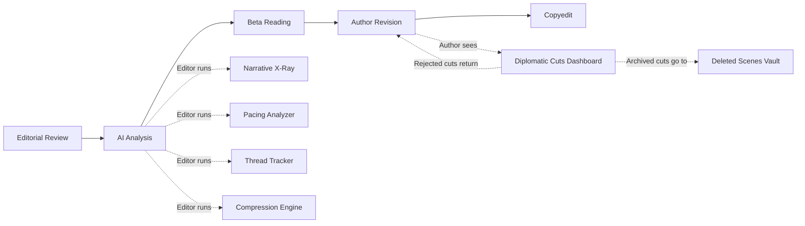

# Rüna Atlas Press — Editor Tools Suite

> **Document Version:** 1.0  
> **Last Updated:** March 12, 2026  
> **Status:** Implementation in progress  
> **Purpose:** Auditor reference for all editor-facing manuscript analysis and editing tools

---

## Executive Summary

The Editor Tools Suite is a set of 6 AI-powered features built into the Forge Editor to help editors manage manuscript length, preserve important narrative elements during cuts, and handle the editing process diplomatically with authors. All tools integrate into the existing **Manuscript Pipeline** (Kanban-based workflow) and operate within the **Forge Editor** (TipTap-based rich text editor).

### Core Principle
> **Editor holds final say** as the representative of the publisher. Authors participate in the process through the Diplomatic Cuts Dashboard but cannot unilaterally block editorial decisions.

---

## Tool Index

| # | Tool | Purpose | Primary User |
|---|------|---------|-------------|
| 1 | Narrative X-Ray | Tag every passage with its narrative function | Editor |
| 2 | Compression Engine | Detect redundancy and suggest tighter prose | Editor |
| 3 | Thread Tracker | Visualize subplot/character arc continuity | Editor |
| 4 | Diplomatic Cuts Dashboard | Negotiate cuts with authors | Editor + Author |
| 5 | Pacing Analyzer | Visualize manuscript rhythm and drag zones | Editor |
| 6 | Structural Architect | Reorder, split, and restructure manuscripts | Editor |

---

## 1. Narrative X-Ray 🧬

### What It Does
Analyzes every paragraph in a manuscript and tags it with its **narrative function** — what that paragraph *does* for the story.

### Narrative Function Tags

| Tag | Icon | Description |
|-----|------|-------------|
| Foreshadowing | 🔮 | Sets up a future payoff or reveal |
| Subplot | 🧵 | Advances a secondary storyline |
| Character Arc | 👤 | Develops a character's internal journey |
| Easter Egg | 🥚 | Callback to previous work or hidden detail |
| Worldbuilding | 🌍 | Establishes setting, lore, or rules |
| Plot Driver | ⚡ | Moves the main plot forward |
| Tone/Atmosphere | 🎭 | Sets mood without advancing story |
| Exposition | 📝 | Delivers information to the reader |
| Redundant | 🔁 | Restates something already established |

### Dependency Chains
The key innovation. When a paragraph is tagged as `Foreshadowing`, the system links it to the paragraph where that foreshadowing pays off. Attempting to cut a paragraph with active dependency chains triggers a warning:

> *"This paragraph foreshadows the reveal in Chapter 18, paragraph 312. Cutting this will make the reveal feel unearned."*

### UI
- **Inspector panel** inside the Forge Editor
- **Heatmap sidebar** — scrollable column showing narrative density by color intensity
- **Filter by tag type** — show only foreshadowing, only redundant, etc.

### Data Storage
Results stored in `manuscripts/{id}/analysis` Firestore subcollection.

---

## 2. Compression Engine ✂️

### What It Does
Identifies passages that can be cut, compressed, or rewritten without losing essential narrative content.

### Analysis Types

| Type | Description |
|------|-------------|
| **Redundancy Detection** | Finds paragraphs that restate information delivered elsewhere in the manuscript |
| **Prose Tightening** | Identifies wordy passages and suggests more concise alternatives |
| **Scene-Level Analysis** | Flags scenes that don't advance plot *or* character development |

### Impact Score (1-10)
Each suggestion includes an impact assessment across 5 dimensions:
1. **Plot coherence** — would the story still make sense?
2. **Character development** — does this cut lose character growth?
3. **Worldbuilding consistency** — does this cut break world rules?
4. **Reader emotional arc** — does this cut hurt the emotional journey?
5. **Pacing rhythm** — does removing this improve or hurt flow?

### Actions per Suggestion
- ✅ Accept — implements the cut
- ❌ Dismiss — hides the suggestion
- ✏️ Modify — editor edits the proposed replacement
- 📤 Send to Author — creates a Diplomatic Cut for author review

---

## 3. Thread Tracker 🕸️

### What It Does
Creates a visual "subway map" of every narrative thread across the entire manuscript.

### Thread Types
- **Subplot** — secondary storylines
- **Character Arc** — internal character journeys
- **Theme** — thematic threads that recur
- **Mystery/Question** — unanswered questions driving reader engagement
- **Relationship** — character relationship dynamics

### Visualization
Each thread is a colored line. "Stations" are the scenes where the thread appears. The subway map shows:
- Where threads get **introduced**
- Where threads **converge** with other threads
- Where threads get **abandoned** (gap of 5+ chapters)
- Where threads **resolve**

### Thread Compression
When a thread appears in, say, 12 scenes but the minimum required for narrative coherence is 7, the system suggests which 5 scenes could be trimmed.

---

## 4. Diplomatic Cuts Dashboard 💬

### What It Does
A structured negotiation interface between editor and author for managing proposed cuts.

### Three-Column Model

| Column | Meaning |
|--------|---------|
| **KEEP** | Passage stays as-is |
| **COMPRESS** | Editor proposes a shorter version; author sees both side-by-side |
| **ARCHIVE** | Passage is removed from manuscript and stored in the **Deleted Scenes Vault** |

### Cut Rationale Tags
Every proposed cut includes a reason:
- `Pacing` — slows momentum at a critical juncture
- `Redundancy` — same information delivered more effectively elsewhere
- `Word Count` — passage adds N words but content can be woven into existing prose
- `Clarity` — passage confuses rather than clarifies
- `Scope` — passage belongs in a sequel or companion work

### Author Response Options

| Option | Description |
|--------|-------------|
| ✅ Accept | Author agrees with the cut |
| ✏️ Counter-propose | Author offers their own shorter version |
| 🛡️ Defend | Author explains why the passage must stay |
| 🔄 Relocate | Author suggests moving it to a different chapter |

### Editor Override
The editor, as representative of the publisher, holds **final say**. If an author defends a passage, the editor can:
1. Accept the defense (passage stays)
2. Override with documented rationale (passage is cut/archived with explanation)

All overrides are logged and auditable.

### Deleted Scenes Vault
Archived passages are **not destroyed**. They move to a `deleted_scenes` collection and can be:
- Published as **bonus content** on the platform
- Offered as **newsletter exclusives**
- Gated behind **membership tiers**
- Included in special editions

---

## 5. Pacing Analyzer 📊

### What It Does
Visualizes the manuscript's narrative rhythm and identifies sections where pacing drags.

### Metrics Analyzed

| Metric | How It's Calculated |
|--------|-------------------|
| **Tension Score** | Sentence length variance, action verb density, dialogue ratio |
| **Drag Zones** | Extended sections where tension score remains flat/low |
| **Scene Tempo** | Fast (mostly dialogue/action) vs slow (mostly description/reflection) |
| **Reading Speed** | Estimated minutes per chapter based on word count and complexity |

### Visualizations
- **Tension curve** — SVG line chart spanning all chapters
- **Drag zone highlights** — red bands overlaid on low-tension stretches
- **Genre benchmark overlay** — dashed reference line showing typical pacing for the manuscript's genre
- **Chapter breakdown** — per-chapter cards with tempo classification

### Genre Benchmarks
Pacing expectations differ by genre:
- **Dark Fantasy** — accelerates through midpoint
- **Literary Fiction** — permits longer reflective stretches
- **Thriller** — consistent high tension with brief drops
- **Romance** — tension peaks at relationship milestones

---

## 6. Structural Architect 🏗️

### What It Does
Tools for manuscripts that need restructuring, not just line-level trimming.

### Features

| Feature | Description |
|---------|-------------|
| **Chapter Reorder Sandbox** | Drag chapters into different orders; see thread continuity impact in real-time |
| **Book Split Detector** | Identifies natural break points for splitting a bloated novel into a duology or series |
| **Timeline View** | For non-linear narratives — shows in-story chronology vs. reading order |
| **Act Structure Overlay** | Maps chapters to 3-act, 5-act, or hero's journey structures |

---

## Pipeline Integration

All tools integrate into the existing **Manuscript Pipeline** (8-stage Kanban):

```
Submission → Editorial Review → 🆕 AI Analysis → Beta Reading → 
Author Revision → Copyedit → Proof → Production → Published
```

The **AI Analysis** stage is where editors run Narrative X-Ray, Pacing Analyzer, and Thread Tracker. Results feed into the **Author Revision** stage where the Diplomatic Cuts Dashboard is active.

### Workflow



---

## Forge Editor Integration

All tools live inside the Forge Editor as **inspector panel tabs**. The Forge already supports:
- ✅ TipTap rich text editing with annotations
- ✅ Chapter management with drag-and-drop reorder
- ✅ Version history and snapshots
- ✅ Collaboration (comments, suggestions, cursors)
- ✅ World Bible (cross-referenced lore)
- ✅ Multiple export formats (DOCX, MD, TXT)

**Authors enter their chapters directly in the Forge.** Editors access the same manuscript with elevated permissions and the analysis tool tabs visible.

---

## Data Model

### Editorial Cut (Firestore: `manuscripts/{id}/cuts/{cutId}`)

```typescript
{
  id: string;
  chapterId: string;
  paragraphIndex: number;
  originalText: string;
  proposedText?: string;
  category: 'keep' | 'compress' | 'archive';
  rationale: string;
  rationaleTag: 'pacing' | 'redundancy' | 'wordcount' | 'clarity' | 'scope';
  impactScore: number;                    // 1-10
  authorResponse?: 'accepted' | 'counter' | 'defend' | 'relocate';
  authorNote?: string;
  editorOverride?: boolean;
  editorOverrideNote?: string;
  status: 'proposed' | 'accepted' | 'rejected' | 'archived';
  createdAt: Timestamp;
  updatedAt: Timestamp;
}
```

### Narrative Analysis Result (Firestore: `manuscripts/{id}/analysis/{chapterId}`)

```typescript
{
  chapterId: string;
  paragraphs: {
    index: number;
    text: string;
    tags: string[];                        // narrative function IDs
    confidence: number;                    // 0-1
    dependencies: { targetChapter: string; targetParagraph: number; type: string }[];
  }[];
  analyzedAt: Timestamp;
}
```

### Thread Definition (Firestore: `manuscripts/{id}/threads/{threadId}`)

```typescript
{
  id: string;
  name: string;
  type: 'subplot' | 'character_arc' | 'theme' | 'mystery' | 'relationship';
  color: string;
  scenes: { chapterId: string; paragraphRange: [number, number]; role: 'intro' | 'develop' | 'climax' | 'resolve' }[];
  status: 'active' | 'abandoned' | 'resolved';
}
```

### Deleted Scene (Firestore: `deleted_scenes/{id}`)

```typescript
{
  id: string;
  manuscriptId: string;
  manuscriptTitle: string;
  chapterTitle: string;
  originalText: string;
  editorNote: string;
  authorName: string;
  publishable: boolean;
  publishedAs?: 'newsletter' | 'membership' | 'special_edition' | 'public';
  archivedAt: Timestamp;
}
```

---

## Permissions Matrix

| Action | Admin | Editor | Author | Reader |
|--------|-------|--------|--------|--------|
| Run Narrative X-Ray | ✅ | ✅ | ❌ | ❌ |
| Run Compression Engine | ✅ | ✅ | ❌ | ❌ |
| Run Pacing Analyzer | ✅ | ✅ | ❌ | ❌ |
| Use Thread Tracker | ✅ | ✅ | 👁️ View | ❌ |
| Use Structural Architect | ✅ | ✅ | ❌ | ❌ |
| Propose cuts | ✅ | ✅ | ❌ | ❌ |
| Respond to cuts | ❌ | ❌ | ✅ | ❌ |
| Override author defense | ✅ | ✅ | ❌ | ❌ |
| View Deleted Scenes | ✅ | ✅ | ✅ Own | 🔒 Gated |
| Publish Deleted Scenes | ✅ | ✅ | ❌ | ❌ |

---

## Technology Stack

| Component | Technology |
|-----------|-----------|
| Rich text editor | TipTap (already in place) |
| Annotations | TipTap Mark extensions (already in place) |
| Visualizations | SVG / inline React components |
| State management | React hooks + Firestore onSnapshot |
| AI analysis | Client-side heuristic analysis (keyword density, sentence patterns, TF-IDF similarity) |
| Drag-and-drop | @dnd-kit/core (already in place) |
| Real-time sync | Firestore real-time listeners |

---

*This document is maintained by the Rüna Atlas Press engineering team. For questions, contact the platform administrator.*
